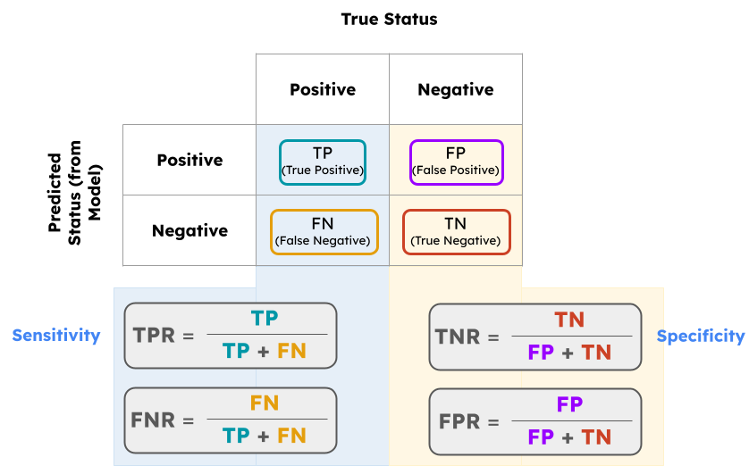
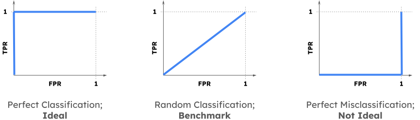

```{r setup, echo = F}
knitr::opts_chunk$set(echo = TRUE)
```

```{r, echo = F}
## optional code chunk;
## gives shortcut for boldface colored text,
## able to be rendered in both PDF and HTML

bfcolor <- function(x, color) {
  if (knitr::is_latex_output()) {
    sprintf("\\textcolor{%s}{\\textbf{%s}}", color, x)
  } else if (knitr::is_html_output()) {
    sprintf("<span style='color: %s;'><b>%s</b></span>", color, x)
  } else x
}
```


# Required Packages

```{r, message = F, warning = F}
library(ottr)        # for checking test cases (i.e. autograding)
library(pander)      # for nicer-looking formatting of dataframe outputs
library(tidyverse)   # for graphs, data wrangling, etc.
library(yardstick)   # for generation of ROC curves
```


# Logistical Details

:::{.callout-note}
## **Logistical Details**

-   This lab is due by **11:59pm on Wednesday, July 23, 2025**.

-   Collaboration is allowed, and encouraged!
    -   If you work in groups, list ALL of your group members' names and NetIDs (not Perm Numbers) in the appropriate spaces in the YAML header above.
    -   Please delete any "MEMBER X" lines in the YAML header that are not needed.
    -   No more than 3 people in a group, please.
    
-   Ensure your Lab properly renders to a `.pdf`; non-`.pdf` submissions will not be graded and will receive a score of 0.

-   Ensure all test cases pass (test cases that have passed will display a message stating `"All tests passed!"`)
:::

# Lab Overview and Objectives

Welcome to another PSTAT 100 Lab! In this lab, we will cover the following:

-   Logistic Regression
-   Classification

# Part I: Review of Relevant Material

## Logistic Regression

A general statistical model relates a **response** variable `y` to a series of **covariates** (aka **predictors**) `x`~1~ through `x`~_p_~ by way of a **signal function** $f(\cdot)$:
\begin{equation}{\label{eq:stat_mod}
  y_i = f(x_{i1}, \cdots, x_{ip}) + \varepsilon_i 
}\end{equation}
for i.i.d. zero-mean and homoskedastic noise $\varepsilon_i$. If the response variable is numerical, (\ref{eq:stat_mod}) is called a **classification** model. In a binary classification problem, the model is often phrased in terms of the **survival probabilities** $\pi_i := \mathds{P}(Y_i = 1)$. A simple example of such a model is the **logistic model**:
\begin{equation}{\label{eq:logistic_mod}
  \pi_i = \Lambda\left( \beta_0 + \sum_{j=1}^{p} \beta_j x_{ij} \right) := \frac{1}{1 + \exp\left\{ \beta_0 + \sum_{j=1}^{p} \beta_j x_{ij} \right\}}  
}\end{equation}
where the function $\Lambda(x) := 1 / (1 + e^{x})$ is called the **logistic** function. An equivalent specification of (\ref{eq:logistic_mod}) is to rephrase the model to be in terms of the **log-odds** of survival:
\begin{equation}{\label{eq:logistic_mod_log_odds}
  \ln\left( \frac{\pi_i}{1 - \pi_i} \right) =  \beta_0 + \sum_{j=1}^{p} \beta_j x_{ij} 
}\end{equation}
Formulation (\ref{eq:logistic_mod_log_odds}) makes it clear that it is not the raw survival probabilities that are a linear combination of the predictor values, but rather the _log-odds_. 

## Classification

A logistic regression model only models the survival _probabilities_. To obtain predicted survival _statuses_, we need to build a **classifier**. A classifier is essentially a rule that takes in a survival probability and outputs either `positive` or `negative`. The simplest form of such a classifier is
\begin{equation}{\label{eq:classifier}
  \{\widehat{Y}_i = 1\} \ \iff \ \{\widehat{\pi}_i > c \} 
}\end{equation}
where $\widehat{\pi}_i$ denotes the _i_^th^ predicted survival probability, and _c_ represents some cutoff. The selection of the cutoff _c_ requires us to a **confusion matrix**:

```{r}
#| echo: False
#| fig.align: 'center'
#| out.width: '70%'

```

-   **True Positive Rate** (aka **Sensitivity**:) of those that had a `positive` status, what proportion were correctly classified as `positive`?
-   **False Negative Rate**: of those that had a `positive` status, what proportion were incorrectly classified as `negative`?
-   **True Negative Rate** (aka **Specificity**:) of those that had a `negative` status, what proportion were correctly classified as `negative`?
-   **False Positive Rate**: of those that had a `negative` status, what proportion were incorrectly classified as `positive`?

Different cutoffs _c_ lead to different class-wise error rates. This enables us to generate a **Receiver Operating Characteristic** (ROC) curve, which plots the TPR (on the vertical axis) against the FPR (on the horizontal axis). Note that an ideal classifier has TPR equal to 1 and FPR equal to zero.

```{r}
#| echo: False
#| fig.align: 'center'
#| out.width: '75%'

```

The ROC curve allows us to select an "optimal" cutoff - namely, the value that corresponds the point on the ROC curve closest to the upper-left diagonal. Furthermore, ROC curves give us one way to compare two possible classification models: we pick whichever model has a ROC curve closer to the ideal pictured above.

# Part II: Building a Classifier

## Introduction to the Dataset

In case you weren't aware, a **date** is a small fruit (often, in the US, sold dried) produced by several different types of date palms that is characterized by a sweet and almost caramel-like flavor. There are actually several different varieties of dates (just like there are different varieties of apples) - in this lab, we will build a classifier to predict the variety of a given date, based on several characteristics. To keep things simple, we're considering a dataset containing only two varieties of date: Sukkari and Safawi.

The particular data we will be working with was actually collected through image analysis - that is, close to a thousand images of various dates were passed through an image classifier to extract out the characteristics of each date. You can find more details about this process by reading [this paper](https://onlinelibrary.wiley.com/doi/10.1155/2021/4793293). We will be working with a version of the data that has been processed slightly; this version is stored in the `date.csv` file, located in the `data/` subfolder.

```{r}
dates <- read.csv("data/date.csv")
```

Let's begin with a quick tabulation of the proportion of each variety of date represented in the data:


:::{.callout-important}
## **Question 1**

Calculate the proportion of each type of date present in the dataset; store this in a vector called `initial_props`. Does one variety appear to be more represented than the other? \

`r bfcolor("Solution:", "blue")`

```{r}
## replace this line with your code
```


`r bfcolor("Answer Check:", "blue")`
```{r, message = F}
# DO NOT EDIT THIS LINE
invisible({check("tests/q1.R")})
```

:::


## Univariate Classifier

A quick Google Image Search reveals that Safawi dates appear to be, on average, slightly more spherical than Sukkari dates. As such, let's construct our first classifier based solely on the eccentricity (stored as a variable called `ECCENTRICITY`) of each date.


:::{.callout-important}
## **Question 2**

**Part (a)**

Create a new column in the `dates` dataframe called `Class_0_1` that re-encodes the `Class` variable as a true binary 0/1 variable. Use `1` for Safawi dates and `0` for Sukkari dates. Then, fit a Logistic Regression of `Class_0_1` on `ECCENTRICITY`, and assign this to a variable called `logistic_ecc_only`.  \

`r bfcolor("Solution:", "blue")`

```{r}
## replace this line with your code
```

`r bfcolor("Answer Check:", "blue")`
```{r, message = F}
# DO NOT EDIT THIS LINE
invisible({check("tests/q2a.R")})
```

\

**Part (b)**

Display the regression table associated with the `logistic_ecc_only` fit you just generated. Does the _p_-value associated with eccentricity appear to be statistically significant at a 5\% level of significance? \

```{r}
## replace this line with your code
```

`r bfcolor("Answer Check:", "blue")`

There is no autograder for this question; your TA will manually check that your answers are correct.

:::

Just to make sure we understand how logistic regression works, let's consider a simple prediction problem. 

:::{.callout-important}
## **Question 3**

A new date (not part of the original dataset) has been selected, with an eccentricity of 0.85. What is the predicted probability that this date is of the Sukkari variety? Assign your answer to a variable called `sukkari_prob1`. **Hint:** remember to be careful about how to interpret the output of `predict()` when using a `glm()` object. Also, remember which variety we used to encode as a `1` value in our `Class_0_1` variable! \

`r bfcolor("Solution:", "blue")`

```{r}
## replace this line with your code
```


`r bfcolor("Answer Check:", "blue")`
```{r, message = F}
# DO NOT EDIT THIS LINE
invisible({check("tests/q3.R")})
```

:::

### 50/50 Classification

Now that we've constructed a logistic model to obtain predicted probabilities, it's time to build a classifier! To begin with, we'll consider a sort of "50/50 classifier" which says: 
\begin{equation}{\label{eq:classifier1}
  \{ \texttt{Variety}_i = \texttt{Safawi}\} \ \iff \ \{ \widehat{\pi}_i > 0.5 \}
}\end{equation}


:::{.callout-important}
## **Question 4**

Using the classifier defined in (\ref{eq:classifier1}) above, calculate the TPR, FNR, TNR, and FPR. Assign these to variables called `tpr1`, `fnr1`, `tnr1`, and `fpr1`, respectively. \

`r bfcolor("Solution:", "blue")`

```{r}
## replace this line with your code
```


`r bfcolor("Answer Check:", "blue")`
```{r, message = F}
# DO NOT EDIT THIS LINE
invisible({check("tests/q4.R")})
```

:::

If you assigned your variables in Question 4 to the right name, the code below should render to create the full confusion matrix:

```{r}
#| error: True
data.frame(`Truth Pos.` = c(tpr1, fnr1),
           `Truth Neg.` = c(tnr1, fpr1),
           row.names = c("Modeled Pos.", "Modeled Neg."),
           check.names = F) %>%
  pander()
```

### Optimal Classification

Our cutoff of 50\% was somewhat arbitrary - let's see if we can improve upon this using ROC curves. 

Before we start generating ROC curves, I'd like to introduce you to the **`tidymodels`** package. Like the `tidyverse`, **`tidymodels`** is actually a _bundle_ of packages, all of which are very useful in statistical modeling. Of particular interest to us is the **`yardstick`** package, which will enable us to generate ROC curves very easy. 

::: {.callout-tip}
## **Tip**

You can read more about the `yardstick` pacakge by consulting its package page: [https://yardstick.tidymodels.org/](https://yardstick.tidymodels.org/).
:::

The function we'll be using to generate ROC curves is called `roc_curve()`. As a simple example of how this function works, let's consider a simulated dataset:

```{r}
set.seed(100)
n <- 1000
x <- rnorm(n)
y <- c()
true_probs <- 1 / (1 + exp(-(0.5 + 1.5 * x)))
for(b in 1:n){
  y[b] <- sample(c(1, 0), size = 1, prob = c(true_probs[b], 1 - true_probs[b]) )
}
```

We first fit a logistic regression:
```{r}
glm1 <- glm(y ~ x, family = "binomial")
```

There are a couple of different `R` functions we can use to generate a ROC curve - the specific function we'll be using is the `roc_curve()` function from the `yardstick` package. 

From the help file, we see that this function expects at least two inputs

-   `data`: the data frame containing the data
-   `truth`: the column that corresponds to the true classification of each argument

In our toy example, this means our data frame should be formatted like

```{r}
#| eval: False
data.frame(
  truth = y %>% factor(),     ## the true classifications
  probs = glm1$fitted.values  ## the probabilities each observation is classified as '1'
)
```

We can now pipe this into `roc_curve()`:


::: {.callout-caution}
## **Caution**

By default, the `roc_curve()` function treats the "first" level (in this case 0) as the "event". Most often we want to actually consider the "1" level as the "event" - hence, we need to specify `event_level = "second"`.
:::

```{r}
data.frame(
  truth = y %>% factor(),
  probs = glm1$fitted.values
) %>%
  roc_curve(truth, 
            probs,
            event_level = "second") %>%
  head()
```

Finally, to generate a plot, we can pipe our result into a call to `autoplot()`:

```{r}
#| fig.align: 'center'
data.frame(
  truth = y %>% factor(),
  probs = glm1$fitted.values
) %>%
  roc_curve(truth, 
            probs,
            event_level = "second") %>%
  autoplot() +
  ggtitle("ROC Curve for Toy Dataset")
```

If we want to find the optimal cutoff, we need to do a bit of work. Specifically, recall that the optimal cutoff is that which corresponds to the point on the ROC curve closest to the diagonal. As such, we can compute the Euclidean distance from each (sensitivity, specificity) pair to the upper-left corner on the plot, and identify the minimum distance. 

```{r}
dist_to_corner <- \(x, y){sqrt((1 - x)^2 + (1 - y)^2)}

(opt_row <- data.frame(
  truth = y %>% factor(),
  probs = glm1$fitted.values
) %>%
  roc_curve(truth, 
            probs,
            event_level = "second") %>%
  mutate(dists = dist_to_corner(sensitivity, specificity)) %>%
  filter(dists == min(dists))
)
```

Just to check our work, we can plot this point on the ROC curve:

```{r}
#| fig.align: 'center'
data.frame(
  truth = y %>% factor(),
  probs = glm1$fitted.values
) %>%
  roc_curve(truth, 
            probs,
            event_level = "second") %>%
  autoplot() +
  ggtitle("ROC Curve for Toy Dataset") +
  annotate("point",
           x = 1 - opt_row$specificity,
           y = opt_row$sensitivity,
           col = "red",
           size = 3)
```

So, it seems that the optimal classifier (in terms of the ROC curve) is
$$\{Y_i = 1 \} \ \iff \ \{\widehat{\pi}_i > 0.645\} $$ 


:::{.callout-important}
## **Question 5**

**Part (a)**

Plot a ROC curve for the `dates` dataset, using the `logistic_ecc_only` model you fit earlier. \

`r bfcolor("Solution:", "blue")`

```{r}
## replace this line with your code
```


`r bfcolor("Answer Check:", "blue")`

There is no autograder for this question; your TA will manually check that your answers are correct.

\

**Part (b)**

Identify the point on the ROC curve closest to the upper-left diagonal. Mark this point on the graph using a large red circle, like in the example above. \


`r bfcolor("Solution:", "blue")`

```{r}
## replace this line with your code
```


`r bfcolor("Answer Check:", "blue")`

There is no autograder for this question; your TA will manually check that your answers are correct.


\

**Part (c)**

A new date (not part of the original dataset) has been selected, with an eccentricity of 0.79. Using the classifier with the optimal cutoff you just derived in part (b), classify this date as either Safawi or Sukkari. \


`r bfcolor("Solution:", "blue")`

```{r}
## replace this line with your code
```


`r bfcolor("Answer Check:", "blue")`

There is no autograder for this question; your TA will manually check that your answers are correct.

:::


## Comparing Classifiers

Finally, let's gain some practice comparing two potential classification models. Specifically, we note (again from a Google Image search) that Sukkari dates appear to be, on average, more yellow-ish in color than Safawi dates. As such, we consider two possible logistic regression models:

-   One that uses only eccentricity as a covariate (the model we investigated above)

-   One that uses only `MeanRR` as a covariate

To help you out, I'll go ahead and fit the model using `MeanRR` for you:

```{r}
#| error: True
logistic_meanrr <- glm(Class_0_1 ~ MeanRR, 
                       data = dates,
                       family = "binomial")
```


:::{.callout-important}
## **Question 6**

Generate a data frame called `roc_meanrr` that stores the ROC curve values for the `logistic_meanrr` model. \

`r bfcolor("Solution:", "blue")`

```{r}
## replace this line with your code
```


`r bfcolor("Answer Check:", "blue")`

There is no autograder for this question; your TA will manually check that your answers are correct.


:::

\

If you completed the questions above correctly, the code below should generate a single plot with both ROC curves superimposed:

```{r}
#| fig-align: 'center'
#| error: True

roc_ecc <- data.frame(
  truth = dates$Class_0_1 %>% factor(),
  probs = logistic_ecc_only$fitted.values
) %>%
  roc_curve(
    truth,
    probs,
    event_level = "second"
  )

rbind(roc_ecc, roc_meanrr) %>% mutate(
  ind = c(rep("Eccentricity", nrow(roc_ecc)), rep("MeanRR", nrow(roc_meanrr))) %>% factor()
) %>%
  ggplot(aes(x = 1 - specificity, y = sensitivity)) +
  geom_path(aes(col = ind), linewidth = 1) +
  geom_abline(lty = 3) +
  coord_equal() +
  theme_bw(base_size = 12) +
  labs(colour = "Model") + 
  ggtitle("ROC Curves") +
  scale_colour_manual(values = c("#E69F00", "#56B4E9"))
```


:::{.callout-important}
## **Question 7**

Based on the figure above, is one model better than the other? How can you tell? \

`r bfcolor("Solution:", "blue")`

_Replace this line with your answer._ \

\

`r bfcolor("Answer Check:", "blue")`

There is no autograder for this question; your TA will manually check that your answers are correct.


:::


:::{.callout-important}
## **Question 8**

If you looked at the dataset documentation linked above, you might have noticed that there are actually two other color-based variables: `MeanRB` and `MeanRG`. Why do you think we didn't include these two in our model with the `MeanRR` variable? **Justify your answer with both code output and an interpretation of this output.** \

`r bfcolor("Solution:", "blue")`

```{r}
## replace this line with your code
```

_Replace this line with your answer._

\

`r bfcolor("Answer Check:", "blue")`

There is no autograder for this question; your TA will manually check that your answers are correct.


:::


# Submission Details

Congrats on finishing this PSTAT 100 lab! Please carry out the following steps:

:::{.callout-note}
## **Submission Details**

1)    Check that all of your tables, plots, and code outputs are rendering correctly in your final `.pdf`.

2)    Check that you passed all of the test cases (on questions that have autograders). You'll know that you passed all tests for a particular problem when you get the message "All tests passed!".

3)    Submit **ONLY** your `.pdf` to Gradescope. Make sure to **match ALL pages to the ONE question on Gradescope**; failure to do so will incur a penalty of 0.1 points.
:::


